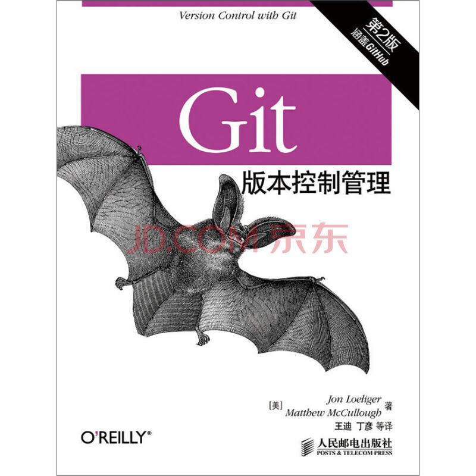

# 阅读前言
“搞程序都几年了，Git都不会，你搞毛啊！”，这是曾经别人对我说这样说，我的心灵再次受到伤害！

正好公司最近使用需要使用git，之前看过一遍《git版本控制管理》，只是有些印像罢了，看技术类的书不动手，你懂的~  
此文只是个开始，把书你的东西做个总结，以备后查。  
下面就请上主角"是它，是它，就是它~"：

# 起步
## git的快速度入门
#### 如何创建初始版本库
我所知道的方法只有两种
1. 使用git init创建一个版本库（书中例子）
2. 使用git clone克隆一个别人的库
由于公司测试服务器上使用gitloite作管理，所以我们直接克隆gitloite的测试库testing  

`git clone git@xxx.xxx.xxx.xxx:/testing`

### 基本命令
有些简单的命令，只做记录  

	git add xxx (git add -A)
	git status
	git commit -m "say something"
	git commit

